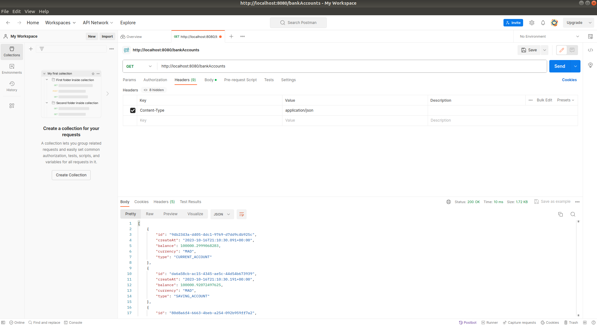
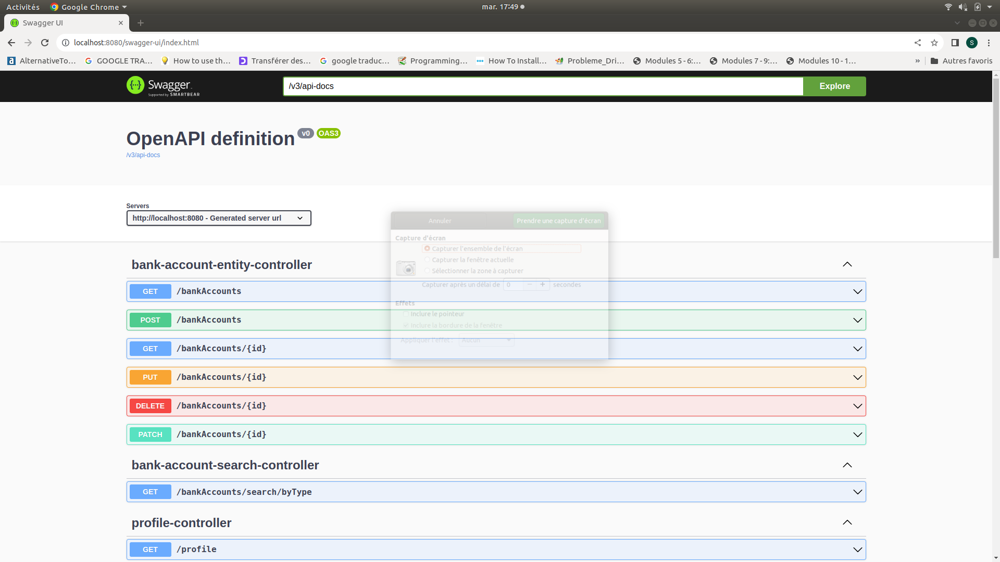
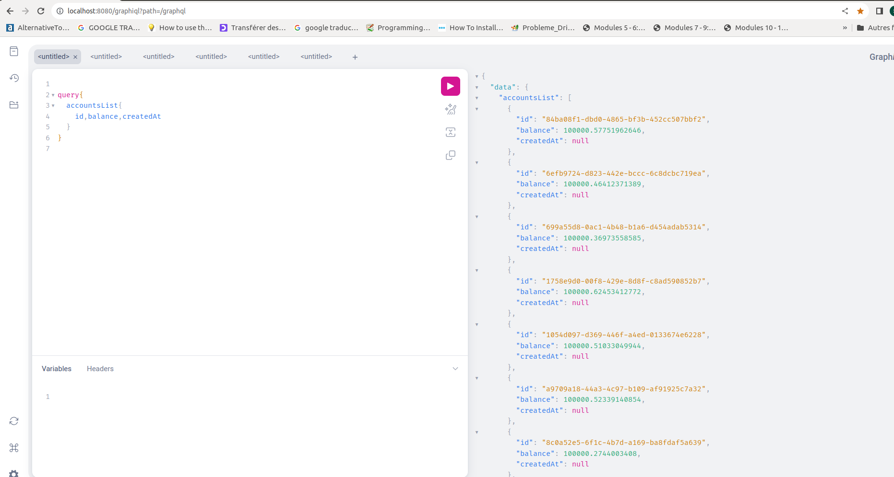
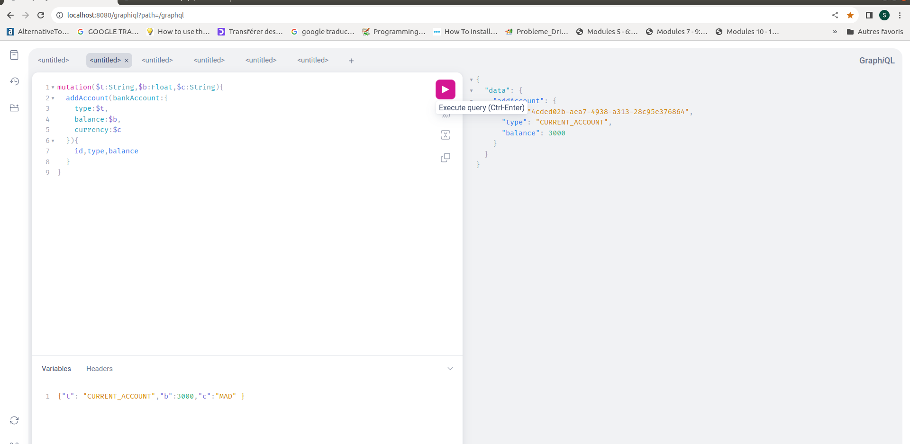
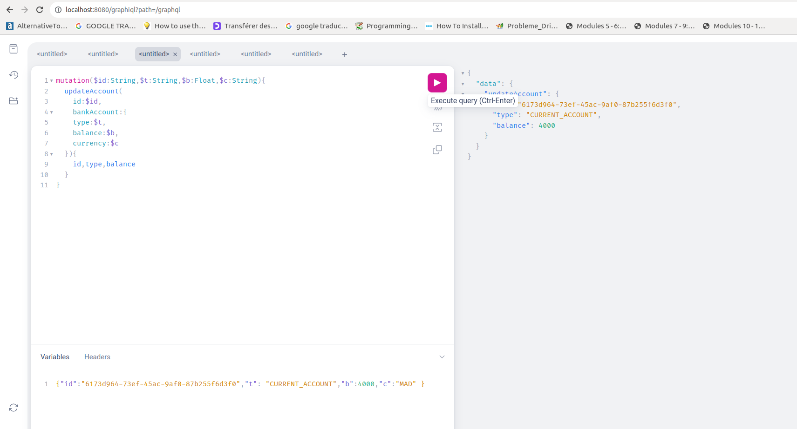
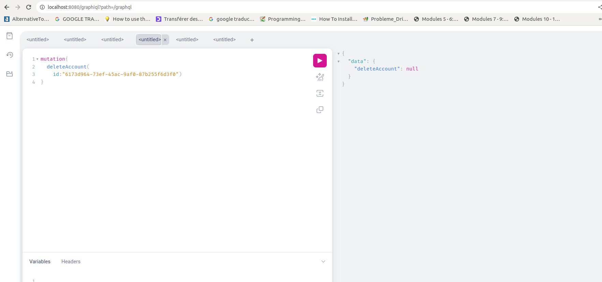
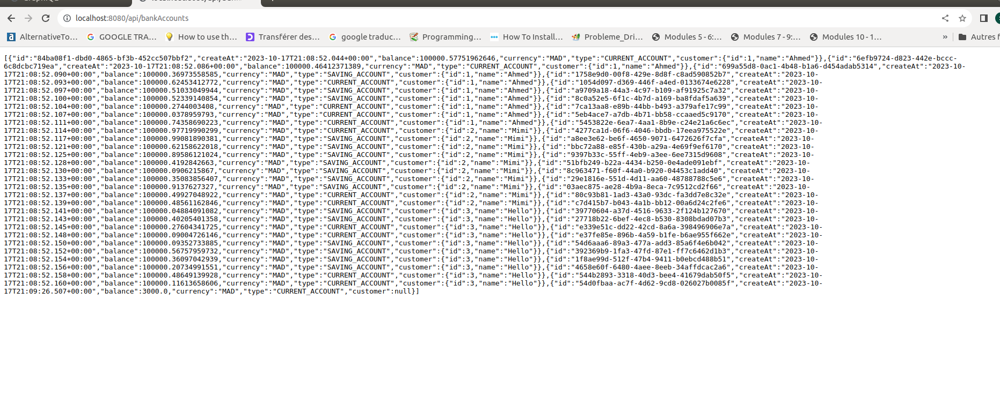

<h1>Compte Rendu Architecture Distribuées:</h1>
<h3>POSTMAN</h3>

<h3>SWAGGER-UI</h3>

<h3>GRAPHQL AFFICHAGE COMPTE BANCAIRE </h3>

<h3>GRAPHQL AJOUTER COMPTE BANCAIRE </h3>

<h3>GRAPHQL MODIFIER COMPTE BANCAIRE</h3>

<h3>GRAPHQL SUPPRIMER COMPTE BANCAIRE</h3>

<h3>API JSON GRAPHQL</h3>

